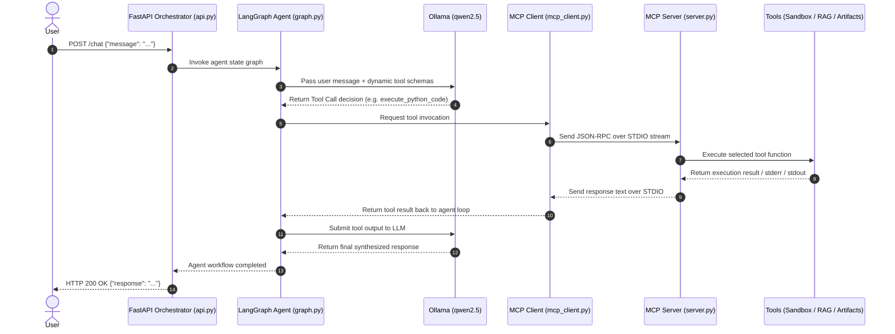

# Sovereign AI Workbench - End-to-End System Documentation

## 📌 Executive Summary

The **Sovereign AI Workbench** (`Neural-Ninjas-SIH26`) is an enterprise-grade, air-gapped, privacy-first AI agent platform. It enables organizations to run autonomous AI agents capable of reasoning, searching internal knowledge bases, executing code, and generating corporate documents **without sending a single byte of sensitive data to external cloud services**.

---

## 🏗️ End-to-End System Architecture

The project employs a modular, microservice-style decoupled architecture connected via Anthropic's **Model Context Protocol (MCP)**:



---

## 🛠️ Deep Dive: Project Tools & Components

### 1. **Orchestrator API Gateway**
* **File**: [`orchestrator/api.py`](file:///d:/SIH26B/Backend/orchestrator/api.py)
* **Technologies**: `FastAPI`, `Uvicorn`, `Pydantic`
* **What it does**: Exposes an HTTP REST endpoint (`POST /chat`) to accept queries from user interfaces or third-party client integrations. Manages the lifecycle (`lifespan`) of the agent and MCP client connection.

---

### 2. **Agent Orchestration Engine**
* **File**: [`orchestrator/graph.py`](file:///d:/SIH26B/Backend/orchestrator/graph.py)
* **Technologies**: `LangGraph`, `LangChain Core`, `langchain-ollama`
* **What it does**: Constructs a stateful Reasoning + Acting (ReAct) agent graph. It dynamically wraps MCP tools into LangChain `@tool` definitions and routes execution cycles between the LLM decision maker and tool handlers.

---

### 3. **Local LLM Engine**
* **Provider**: `Ollama` running `qwen2.5`
* **What it does**: Functions as the primary "brain" of the agent. Interprets user prompts, decides which tool to call with specific arguments, and formats the final structured response.

---

### 4. **Model Context Protocol (MCP) IPC Layer**
* **Files**: [`orchestrator/mcp_client.py`](file:///d:/SIH26B/Backend/orchestrator/mcp_client.py), [`mcp_server/server.py`](file:///d:/SIH26B/Backend/mcp_server/server.py)
* **Technology**: `mcp[cli]` (Model Context Protocol Python SDK)
* **What it does**: Establishes a standardized, asynchronous sub-process communication channel over `STDIO` between the orchestrator client and the tool execution server.

---

### 5. **Docker Code Sandbox Tool**
* **Tool Name**: `execute_python_code`
* **File**: [`mcp_server/tools/sandbox.py`](file:///d:/SIH26B/Backend/mcp_server/tools/sandbox.py)
* **Technologies**: `docker` Python SDK, `python:3.10-slim`
* **What it does**: Takes raw Python code generated by the LLM, mounts it into a temporary volume, and executes it inside an ephemeral, air-gapped Docker container.
* **Security Controls**:
  * `network_mode="none"`: No internet/network access.
  * `mem_limit="512m"`: Memory limit capped at 512 MB.
  * `cpu_quota=50000`: CPU usage restricted to 50% max.
  * `remove=True`: Automatic container deletion upon completion.

---

### 6. **RAG Knowledge Base Tool**
* **Tool Name**: `search_knowledge_base`
* **File**: [`mcp_server/tools/rag.py`](file:///d:/SIH26B/Backend/mcp_server/tools/rag.py)
* **Technologies**: `ChromaDB`, `BAAI/bge-large-en-v1.5` (Sentence Transformers)
* **What it does**: Performs semantic similarity searches against internal document collections stored in a local persistent vector store (`knowledge_base/`).

---

### 7. **Artifact Generation Tools**
* **Tools**: `generate_word_document`, `generate_excel_spreadsheet`
* **File**: [`mcp_server/tools/artifacts.py`](file:///d:/SIH26B/Backend/mcp_server/tools/artifacts.py)
* **Technologies**: `python-docx`, `openpyxl`
* **What it does**:
  * Generates professional Word (`.docx`) notes/reports with formatted headers and bullet points.
  * Parses tabular JSON data to build formatted Excel (`.xlsx`) spreadsheets.

---

## ⚡ Tool Choice Rationale & Architectural Advantages

| Tool / Technology | What Was Used | Alternative Option | Why This Choice is Better |
| :--- | :--- | :--- | :--- |
| **LLM Inference** | **Ollama (`qwen2.5`)** | OpenAI GPT-4, Claude API | **100% Data Sovereignty & Zero Cost**: Cloud APIs risk data leaks and incur recurring per-token costs. Running Qwen 2.5 via Ollama ensures complete privacy, zero telemetry, and air-gapped deployment capability. |
| **Tool Protocol** | **Model Context Protocol (MCP)** | Hardcoded functions inside agent code | **Decoupling & Process Isolation**: MCP separates tool execution from the agent logic. Tools run in their own environment/process. Adding new tools requires zero changes to the core orchestrator, standardizing integrations across languages. |
| **Agent Framework** | **LangGraph** | Standard LangChain Sequential Chains, AutoGen | **Cyclic State Control & Fault Tolerance**: Traditional chains are linear. LangGraph handles complex decision loops, agent re-tries, state preservation, and multi-step reasoning robustly. |
| **Code Execution** | **Docker Sandbox Container** | Native `exec()` / `eval()` / Local Subprocess | **Security & Exploit Prevention**: Executing LLM-generated code locally via `exec()` risks system corruption, file deletion, or malicious shell injection. Docker containerization enforces hardware limits, memory caps, and zero network access. |
| **Vector DB** | **ChromaDB + BAAI BGE-Large** | Pinecone, Weaviate, Naive Text Match | **Fully Local & Top Retrieval Performance**: Pinecone requires cloud hosting. ChromaDB runs embedded on disk. `BAAI/bge-large-en-v1.5` offers top-tier retrieval accuracy without sending document vectors to third parties. |
| **Artifact Generation** | **`python-docx` & `openpyxl`** | Plain Text / Raw CSV / HTML | **Enterprise Compatibility**: Enterprises operate on native Microsoft Office formats (`.docx` and `.xlsx`). Direct binary generation provides immediate business utility without formatting conversion steps. |

---

## 🚀 How to Run the Application

### 1. Prerequisites
* **Python**: `3.10` or higher installed
* **Docker Desktop**: Running locally (for code execution sandbox)
* **Ollama**: Installed and running locally
  ```bash
  ollama pull qwen2.5
  ```

### 2. Environment Setup
```bash
# Create and activate virtual environment
python -m venv venv
venv\Scripts\activate

# Install dependencies
pip install -r Backend/requirements.txt
```

### 3. Launch the API Gateway
```bash
python Backend/orchestrator/api.py
```
* The server will initialize the MCP Client, establish connection to the MCP Server over STDIO, bind the tools, and start the FastAPI server at `http://localhost:8000`.

### 4. Interact with the System
Send a request to the `/chat` endpoint:
```bash
curl -X POST "http://localhost:8000/chat" \
     -H "Content-Type: application/json" \
     -d "{\"message\": \"Write a python script that calculates the Fibonacci sequence up to 10 terms and run it in the sandbox.\"}"
```
