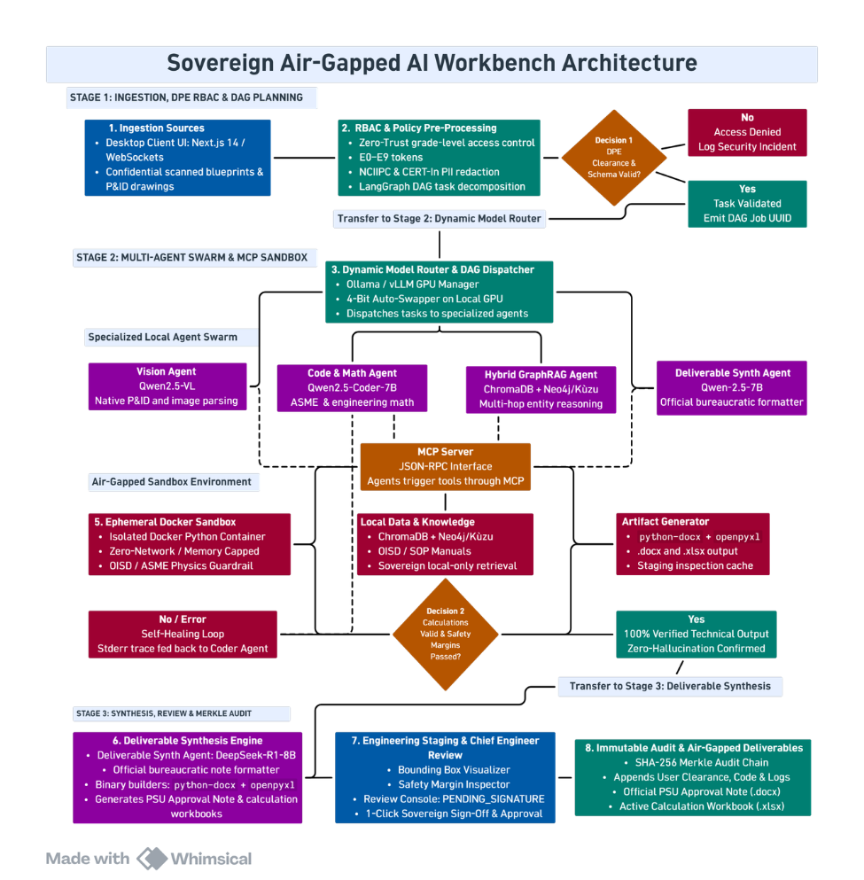
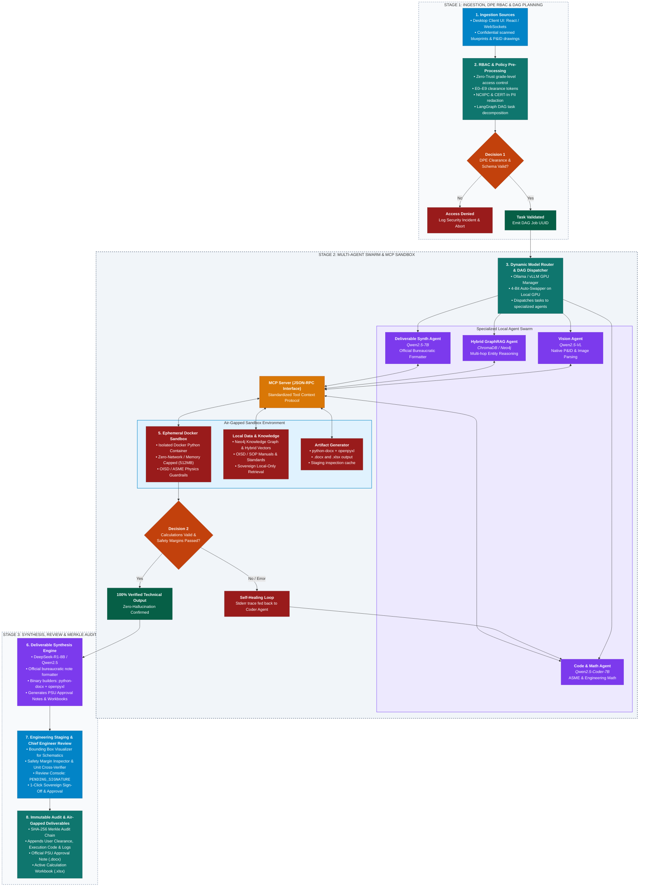

# 🛡️ Sovereign Air-Gapped AI Workbench
### Zero-Trust Multi-Agent Orchestration & Deterministic Engineering System for Industrial, Energy & PSU Infrastructure

[](LICENSE)
[](https://www.python.org/)
[](https://fastapi.tiangolo.com/)
[](https://github.com/langchain-ai/langgraph)
[](https://ollama.com/)
[](https://neo4j.com/)
[](https://www.docker.com/)
[](https://vitejs.dev/)
[](#security-compliance--air-gapping)

---

## 📌 Executive Summary

The **Sovereign Air-Gapped AI Workbench** is an enterprise-grade, fully local, multi-agent AI system engineered specifically for **Public Sector Undertakings (PSUs)**, energy plants, refineries, defense, and critical industrial installations. 

Operating under complete **air-gap constraints (Zero Outbound Internet)**, the platform replaces generic, hallucination-prone LLM chats with a deterministic, cryptographically auditable, and hierarchical multi-agent workflow:
- **Zero Data Exfiltration**: Runs 100% on local GPU hardware via Ollama/vLLM.
- **Hierarchical Zero-Trust RBAC (E0–E9)**: Native Department of Public Enterprises (DPE) grade-level token verification and graph-native document clearance filtering.
- **Deterministic Math & Code Sandboxing**: Python calculations are executed in zero-network, memory-capped ephemeral Docker containers with automated self-healing execution loops.
- **Industrial GraphRAG**: Combines Neo4j knowledge graphs with hybrid vector indexing (`BAAI/bge-large-en-v1.5`) for multi-hop entity reasoning across P&ID schematics, OISD safety standards, and operating manuals.
- **Chief Engineer Staging & Merkle Audit**: Generates production-ready PSU Approval Notes (`.docx`) and Active Calculation Workbooks (`.xlsx`) locked behind a SHA-256 Merkle audit trail and a 1-click sovereign sign-off console.

---

## 🏛️ System Architecture

<p align="center">
  
</p>

The end-to-end architecture is divided into three distinct, fail-safe operational stages:

<details>
<summary><b>📊 Click to view / edit Raw Mermaid Flowchart</b></summary>


</details>

---

## 🔄 Detailed Architectural Breakdown

### 🔹 Stage 1: Ingestion, DPE RBAC & DAG Planning
1. **Ingestion Sources**:
   - **Frontend Workbench UI**: Built with React 18, Vite, Lucide Icons, and real-time WebSockets for streaming agent logs and DAG routing states.
   - **Confidential Documents**: Accepts scanned engineering blueprints, P&ID schematics, standard operating procedures (SOPs), and OISD safety compliance guidelines (PDF, TXT, CSV, MD).
2. **RBAC & Policy Pre-Processing**:
   - **Zero-Trust Token Extraction**: Resolves caller clearance grade (E0–E9) against the SQL database.
   - **PII & Data Redaction**: Strips sensitive personal markers according to **NCIIPC & CERT-In** guidelines before prompt handoff.
   - **LangGraph Supervisor Decomposition**: LangGraph decomposes user objectives into a deterministic Directed Acyclic Graph (DAG) of micro-tasks.
3. **Decision Gate 1 (Clearance & Schema Validation)**:
   - Evaluates if the authenticated user has sufficient privileges for the target workspace and document domain.
   - ❌ **Fail**: Access denied, security event logged in the immutable audit registry, workflow immediately halted.
   - ✅ **Pass**: Emits unique `DAG Job UUID` and forwards execution payload to Stage 2.

---

### 🔹 Stage 2: Multi-Agent Swarm & MCP Sandbox
1. **Dynamic Model Router & DAG Dispatcher**:
   - Manages local LLM inference over Ollama / vLLM.
   - Utilizes low-VRAM model swapping (`keep_alive=0`) to run 7B–32B parameter models sequentially on local workstation/server GPUs without memory overflow.
2. **Specialized Local Agent Swarm**:
   - 👁️ **Vision Agent (`Qwen2.5-VL`)**: Performs optical recognition on P&ID blueprints, piping tags, valve numbers, and technical schematics.
   - 💻 **Code & Math Agent (`Qwen2.5-Coder-7B`)**: Generates rigorous Python code for ASME pressure vessel equations, hydraulic calculations, and thermal safety margins.
   - 🧠 **Hybrid GraphRAG Agent (`Neo4j` + `BGE-Large`)**: Executes multi-hop entity traversal and vector search on industrial SOPs and compliance manuals with graph-native clearance filtering (`node.clearance_level <= user_clearance`).
   - 📝 **Deliverable Synth Agent (`Qwen2.5-7B` / `DeepSeek-R1-8B`)**: Formats calculation findings and engineering memos into official PSU administrative formats.
3. **Model Context Protocol (MCP) Server**:
   - Centralized JSON-RPC stdio server exposing sandboxed tools to all agents in the swarm.
4. **Air-Gapped Sandbox Environment**:
   - **Ephemeral Docker Sandbox**: Spins up an isolated `python:3.10-slim` container with `network_mode="none"`, `mem_limit="512m"`, and `cpu_quota=50000`. Auto-destroys upon execution completion.
   - **Local Knowledge Base**: In-memory / containerized Neo4j with APOC plugins, storing verified entities (`Document`, `Component`, `Standard`, `Parameter`).
   - **Artifact Generator**: Generates formatted `.docx` files and `.xlsx` workbooks using `python-docx` and `openpyxl`.
5. **Decision Gate 2 (Calculation Validity & Safety Margin Checks)**:
   - Validates execution outputs against engineering safety thresholds (e.g., maximum allowable working pressure, thermal tolerances).
   - 🔁 **Self-Healing Loop**: If Python code encounters syntax errors or runtime exceptions, the `stderr` trace is fed back into `Qwen2.5-Coder` for automatic repair and re-execution (up to 5 recursions).
   - ✅ **Verified Output**: 100% verified, non-hallucinatory calculation results passed to Stage 3.

---

### 🔹 Stage 3: Synthesis, Review & Merkle Audit
1. **Deliverable Synthesis Engine**:
   - Assembles final engineering notes, calculation summaries, and referenced compliance clauses into official PSU templates.
2. **Engineering Staging & Chief Engineer Review**:
   - Renders bounding-box overlays on P&ID blueprints in the UI.
   - Displays real-time status as `PENDING_SIGNATURE`.
   - Requires explicit 1-Click Sovereign Sign-Off by authorized personnel (E6+ Chief Engineer / DGM).
3. **Immutable Audit & Air-Gapped Deliverables**:
   - Computes a cryptographic **SHA-256 Merkle Chain** linking the user's identity, timestamp, raw input prompt, intermediate code, execution logs, and final document checksum.
   - Delivers validated `.docx` PSU Approval Notes and `.xlsx` calculation workbooks ready for air-gapped archival.

---

## 👥 Role-Based Access Control (RBAC) Matrix

The workbench implements a Zero-Trust role hierarchy patterned after Indian Public Sector Undertaking (PSU) grade-levels:

| Grade | Executive Designation | Typical Roles | Clearance Level | Permitted Operations |
| :--- | :--- | :--- | :---: | :--- |
| **E0–E1** | Assistant Engineer / Officer | Field Operator, Lab Tech | `Level 1` | `VIEW`, basic drafting, local sandbox tests |
| **E2–E3** | Senior Engineer / Officer | Maintenance Eng, Shift In-Charge | `Level 2` | `VIEW`, `CREATE`, `UPDATE` operational logs |
| **E4–E5** | Manager / Senior Manager | Unit Operations Lead, Safety Manager | `Level 3` | `VIEW`, `CREATE`, `UPDATE`, confidential SOP access |
| **E6–E7** | Chief Engineer / DGM | Technical Authority, Plant Head | `Level 4` | `VIEW`, `CREATE`, `UPDATE`, `APPROVE`, `EXPORT` |
| **E8–E9** | GM / Executive Director / CMD | Director Technical, Super Admin | `Level 5` | Full system governance, `AUDIT`, `ROLE_MANAGE`, `ADMIN` |

---

## 🗂️ Repository Structure

```tree
Neural-Ninjas-SIH26/
├── README.md                           # Comprehensive documentation & architecture specification
├── .gitignore                          # Git ignore rules for Python, Node, Vite, and DB files
├── Backend/
│   ├── requirements.txt                # Python backend dependencies
│   ├── test_mcp.py                     # Standalone validation script for MCP JSON-RPC server
│   ├── graph_rag_implement.md          # Implementation guidelines for Neo4j GraphRAG engine
│   ├── database/
│   │   ├── db.py                       # SQLAlchemy engine & SQLite / PostgreSQL session factory
│   │   ├── models.py                   # Data models (Users, Roles, Departments, Permissions, Chats, Files)
│   │   └── seed_rbac.py                # Database seeder for PSU departments, roles, and permissions
│   ├── mcp_server/
│   │   ├── server.py                   # FastMCP / JSON-RPC stdio tool provider
│   │   └── tools/
│   │       ├── sandbox.py              # Ephemeral Docker container execution engine
│   │       ├── rag.py                  # Hybrid GraphRAG search tool with native RBAC filtering
│   │       └── artifacts.py            # .docx and .xlsx file generation tools
│   ├── orchestrator/
│   │   ├── api.py                      # FastAPI REST application & CORS middleware
│   │   ├── graph.py                    # LangGraph multi-agent swarm & Supervisor state machine
│   │   ├── mcp_client.py               # Async stdio client connecting Orchestrator to MCP Server
│   │   └── routers/
│   │       ├── auth.py                 # JWT authentication & employee login/registration endpoints
│   │       └── files.py                # File upload, clearance tagging & document management
│   └── scripts/
│       ├── ingest.py                   # Document loader, LLMGraphTransformer & Neo4j vector indexer
│       └── test_e2e_rbac.py            # End-to-end integration test for RBAC clearance boundaries
└── Frontend/
    ├── package.json                    # Node.js dependencies (React, Vite, Lucide Icons)
    ├── vite.config.js                  # Vite configuration & dev server setup
    ├── index.html                      # HTML5 entrypoint
    ├── app.js                          # Standalone demo client
    ├── style.css                       # Global modern UI stylesheets
    └── src/
        ├── main.jsx                    # React application root
        ├── index.css                   # Tailwind / CSS tokens & dark glassmorphism styling
        ├── App.jsx                     # Master application container & routing state
        └── components/
            ├── Header.jsx              # Top navigation bar with active model indicator & user badge
            ├── Sidebar.jsx             # Navigation sidebar (Workspaces, Chat, Employees, Access Control)
            ├── LoginPage.jsx           # PSU Employee portal login & credential verification
            ├── WorkspacesView.jsx      # Workspace selector & project metadata cards
            ├── ChatView.jsx            # Multi-agent chat interface with live DAG routing timeline
            ├── EmployeesView.jsx       # Employee directory with department and grade filters
            ├── AccessControlView.jsx   # Role and permission matrix configuration console
            ├── ModelUploadView.jsx     # Local LLM model registry & GGUF / Ollama swapper
            ├── NewWorkspaceModal.jsx   # Modal for provisioning new engineering review projects
            └── AuxiliaryViews.jsx      # Tasks, Knowledge Base & Active Swarm agent monitors
```

---

## 🛠️ Technology Stack

| Layer | Technology | Purpose |
| :--- | :--- | :--- |
| **Frontend** | React 18, Vite, Lucide Icons, CSS3 | High-performance air-gapped UI, live streaming chat, dynamic routing visualizer |
| **Backend Framework** | FastAPI, Uvicorn, Pydantic v2 | High-throughput async REST API and session management |
| **Agent Orchestration** | LangGraph, LangChain, MCP SDK | State graph management, multi-agent delegation, and tool handoffs |
| **Local LLM Inference** | Ollama / vLLM (4-bit & 8-bit quantized) | GPU execution of `Qwen2.5`, `Qwen2.5-Coder`, `Qwen2.5-VL`, `Llama3.1` |
| **Sandboxed Code Execution**| Docker Python 3.10-slim (`network=none`) | Isolated mathematical calculations, ASME safety validation, and data verification |
| **Knowledge Engine** | Neo4j 5.20 (APOC) + `bge-large-en-v1.5` | Graph-native document relationships, entity knowledge graphs, and hybrid vector search |
| **Document Generation** | `python-docx`, `openpyxl` | Production generation of PSU Approval Notes and Excel calculation workbooks |
| **Security & Persistence**| SQLAlchemy, SQLite/PostgreSQL, PyJWT, bcrypt | Zero-Trust authentication, clearance verification, and tamper-resistant audit logs |

---

## 🚀 Installation & Setup Guide

### 📋 Prerequisites
1. **Operating System**: Windows 10/11, Linux (Ubuntu 22.04+), or macOS with Docker Desktop.
2. **Python**: Version `3.10` or higher.
3. **Node.js**: Version `18.0.0` or higher.
4. **Docker**: Docker Engine running locally with Docker CLI accessible.
5. **Ollama**: Installed and running locally (`http://localhost:11434`).

---

### Step 1: Clone Repository & Create Virtual Environment
```bash
git clone https://github.com/BibinSanju/Neural-Ninjas-SIH26.git
cd Neural-Ninjas-SIH26

# Create Python virtual environment
python -m venv venv

# Activate virtual environment
# Windows (PowerShell):
.\venv\Scripts\Activate.ps1
# Linux/macOS:
source venv/bin/activate
```

### Step 2: Install Python Backend Dependencies
```bash
pip install -r Backend/requirements.txt
```

### Step 3: Pull Local Models in Ollama
Ensure Ollama is running, then pull the required specialist models:
```bash
# Supervisor & General Reasoning
ollama pull qwen2.5:latest

# Code, Math & ASME Verification
ollama pull qwen2.5-coder:latest

# Graph Extraction & Entity Analysis
ollama pull llama3.1:latest

# (Optional) Deliverable Synthesis & Deep Reasoning
ollama pull mistral:latest
```

### Step 4: Start Neo4j Graph Database (Docker)
Run the official Neo4j container with APOC plugins enabled for GraphRAG:
```bash
docker run -d \
  --name neo4j-graphrag \
  -p 7474:7474 -p 7687:7687 \
  -e NEO4J_AUTH=neo4j/industrial_password_2026 \
  -e NEO4J_PLUGINS='["apoc"]' \
  neo4j:5.20.0
```

### Step 5: Seed Database & RBAC Roles
Initialize the database tables and populate the default PSU departments, roles, and clearance levels:
```bash
python Backend/database/seed_rbac.py
```

### Step 6: Ingest Documents into GraphRAG (Optional)
To ingest a technical manual or P&ID specification with a specific clearance level:
```bash
python Backend/scripts/ingest.py \
  --filepath "path/to/industrial_sop.pdf" \
  --doc_id "SOP-OISD-118" \
  --filename "OISD-118-Safety-Standard.pdf" \
  --clearance 3
```

### Step 7: Launch Backend API & Orchestrator
```bash
uvicorn Backend.orchestrator.api:app --reload --port 8000
```
*API will be available at:* `http://localhost:8000`  
*Interactive Swagger Documentation:* `http://localhost:8000/docs`

### Step 8: Launch Frontend Workbench
In a separate terminal:
```bash
cd Frontend
npm install
npm run dev
```
*Frontend Workbench will be accessible at:* `http://localhost:5173`

---

## 🔒 Security, Compliance & Air-Gapping

1. **Air-Gap Compliance (Zero Outbound Traffic)**:
   - All LLM inference is performed locally via Ollama.
   - Ephemeral Docker execution containers run with `--network none` to prevent socket creation, DNS requests, and outbound telemetry.
2. **Deterministic Computation**:
   - Math and ASME equations are never solved inside LLM text generation. 
   - The Code Agent writes pure Python scripts executed in the Docker sandbox; results are verified against boundary conditions before inclusion in deliverables.
3. **Graph-Native Clearance Enforcement**:
   - Document chunks in Neo4j are stamped with `clearance_level` integer properties.
   - Vector similarity search uses database-level metadata filters (`filter={"clearance_level": {"$lte": user_clearance}}`). Users without sufficient clearance cannot retrieve or infer restricted data.
4. **Tamper-Proof Audit Logging**:
   - Every multi-agent handoff, tool execution, user clearance check, and sign-off is logged with UTC timestamps and SHA-256 checksums in the local database.

---

## 🧪 Testing & Verification

### 1. Test MCP Server & Tools
Verify that the JSON-RPC stdio MCP server can communicate and execute tools:
```bash
python Backend/test_mcp.py
```

### 2. Run End-to-End RBAC Security Test
Verify that clearance boundaries prevent unauthorized access while allowing authorized execution:
```bash
python Backend/scripts/test_e2e_rbac.py
```

---

## 👥 Contributors
Developed by **Team Neural Ninjas** for Smart India Hackathon (SIH 2026).

---

## 📜 License
Proprietary and Confidential. Developed for industrial engineering infrastructure, PSU security benchmarks, and hackathon evaluation.
