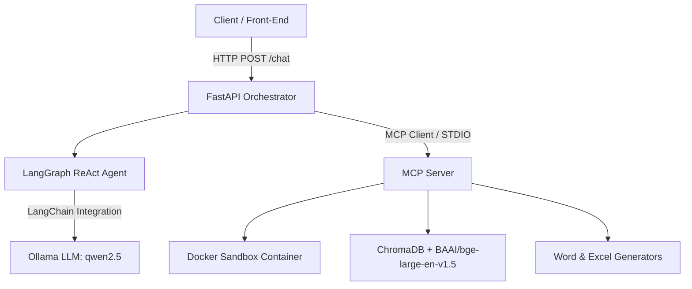

# Tech Stack Specification - Sovereign AI Workbench

## 🧱 Architecture Overview
The **Sovereign AI Workbench** (`Neural-Ninjas-SIH26`) is a privacy-focused, air-gapped AI agent platform built with a decoupled architecture:
1. **Orchestrator Service**: A FastAPI server running a LangGraph ReAct agent loop powered by a local Ollama LLM (`qwen2.5`).
2. **MCP (Model Context Protocol) Server**: A standalone tool server handling sandboxed code execution, vector knowledge base retrieval, and automated document generation.



---

## 🛠️ Technology Stack Breakdown

| Category | Technology / Library | Purpose | Key Project Files |
| :--- | :--- | :--- | :--- |
| **Language & Runtime** | **Python 3.10+** | Primary programming language across services | All Backend Files |
| **API Framework** | **[FastAPI](https://fastapi.tiangolo.com/)** | Web API layer hosting endpoints | [`orchestrator/api.py`](file:///d:/SIH26B/Backend/orchestrator/api.py) |
| **ASGI Server** | **Uvicorn** | High-performance asynchronous web server | [`orchestrator/api.py`](file:///d:/SIH26B/Backend/orchestrator/api.py) |
| **Data Validation** | **Pydantic** | Request & response data modeling | [`orchestrator/api.py`](file:///d:/SIH26B/Backend/orchestrator/api.py) |
| **Agent Framework** | **[LangGraph](https://github.com/langchain-ai/langgraph)** | Stateful graph-based ReAct agent orchestration | [`orchestrator/graph.py`](file:///d:/SIH26B/Backend/orchestrator/graph.py) |
| **LLM Provider** | **[Ollama](https://ollama.com/) (`qwen2.5`)** | Air-gapped, privacy-compliant local LLM | [`orchestrator/graph.py`](file:///d:/SIH26B/Backend/orchestrator/graph.py) |
| **LLM Integration** | **LangChain Core & Ollama** | Model abstractions and tool binding | [`orchestrator/graph.py`](file:///d:/SIH26B/Backend/orchestrator/graph.py) |
| **Protocol** | **Model Context Protocol (`mcp[cli]`)** | Standardized agent-tool transport over STDIO | [`mcp_server/server.py`](file:///d:/SIH26B/Backend/mcp_server/server.py)<br>[`orchestrator/mcp_client.py`](file:///d:/SIH26B/Backend/orchestrator/mcp_client.py) |
| **Vector DB** | **ChromaDB** | Local persistent vector storage for RAG search | [`mcp_server/tools/rag.py`](file:///d:/SIH26B/Backend/mcp_server/tools/rag.py) |
| **Embedding Model** | **Sentence Transformers** (`BAAI/bge-large-en-v1.5`) | Neural embedding generator for retrieval | [`mcp_server/tools/rag.py`](file:///d:/SIH26B/Backend/mcp_server/tools/rag.py) |
| **Sandboxing** | **Docker Python SDK (`docker`)** | Isolated Python script execution (`python:3.10-slim`) | [`mcp_server/tools/sandbox.py`](file:///d:/SIH26B/Backend/mcp_server/tools/sandbox.py) |
| **Word Generation** | **`python-docx`** | Automated `.docx` document and report generation | [`mcp_server/tools/artifacts.py`](file:///d:/SIH26B/Backend/mcp_server/tools/artifacts.py) |
| **Excel Generation** | **`openpyxl`** | Automated `.xlsx` spreadsheet creation | [`mcp_server/tools/artifacts.py`](file:///d:/SIH26B/Backend/mcp_server/tools/artifacts.py) |
| **Environment** | **`python-dotenv`** | Management of local environment variables | [`requirements.txt`](file:///d:/SIH26B/Backend/requirements.txt) |

---

## 📦 Package Dependencies (`Backend/requirements.txt`)

```txt
fastapi
uvicorn
mcp[cli]
langchain
langgraph
langchain-community
langchain-ollama
docker
chromadb
sentence-transformers
python-docx
openpyxl
pydantic
python-dotenv
```
